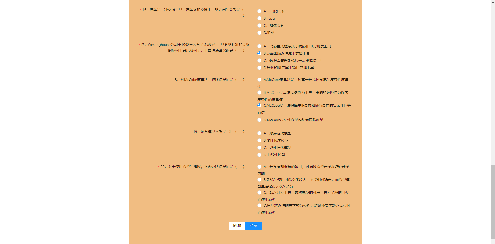
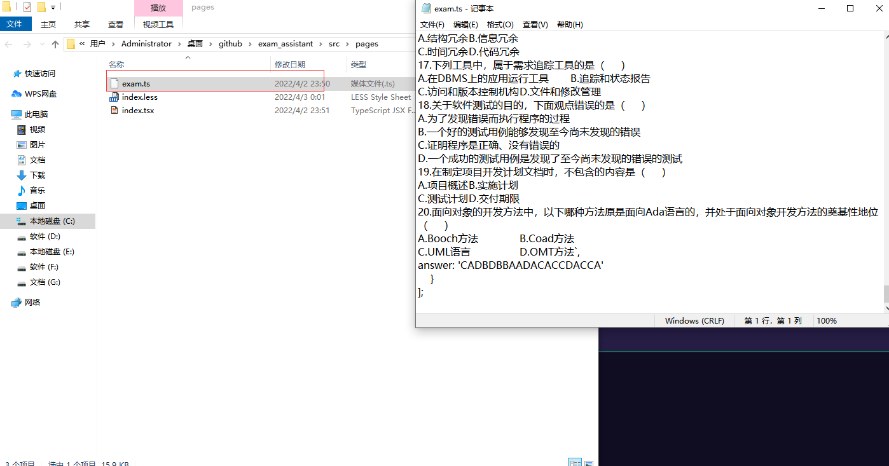

## 一款选择题刷题小项目

<b>项目启动方法</b>
1、在项目根目录下运行cmd
```
npm i or yarn
```

<b>使用效果图</b><br/>
<br />
<b>添加题目方法<b/>

找到exam.ts文件用记事本打开;<br/>
记住题目的格式要规定的；<br/>
可以参考我提供的样例文件；<br/>
```
[
    {
        exam: `这个字段里是题目`,
        answer: '这个字段里是答案，数量要对象题目的数量(记住用大写)'
    }
]
```

